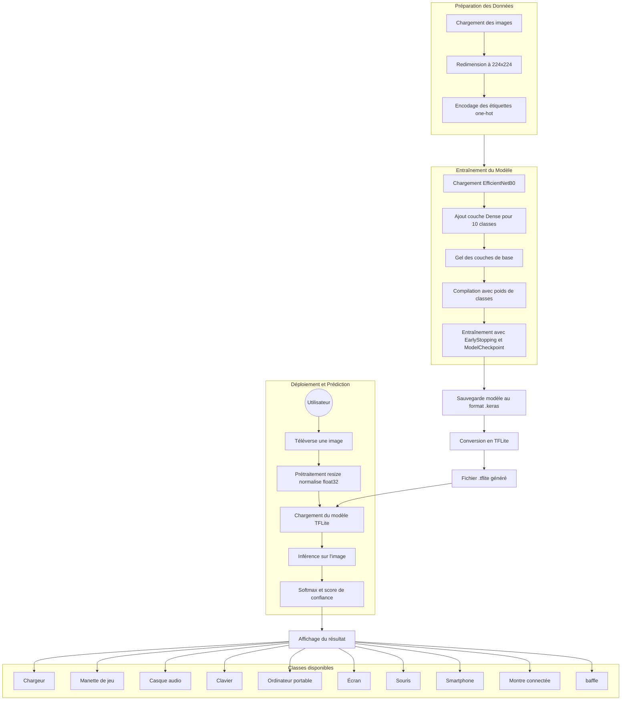
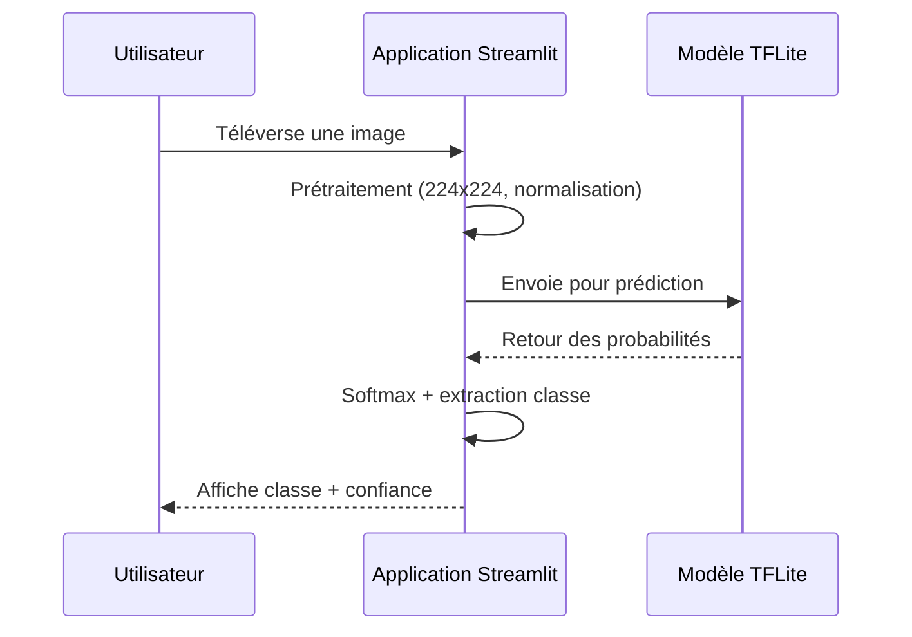
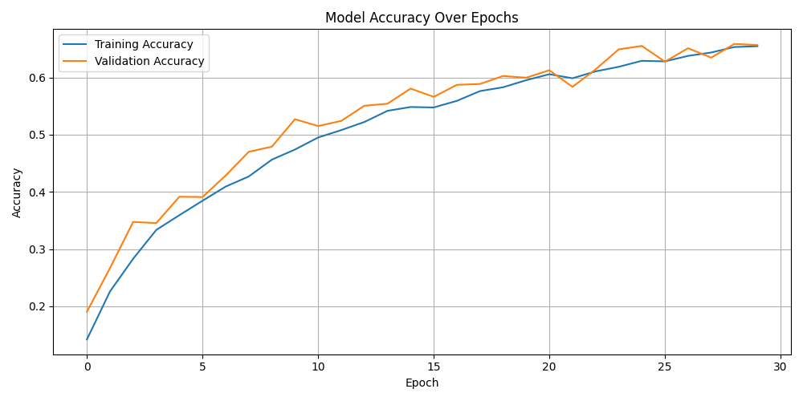
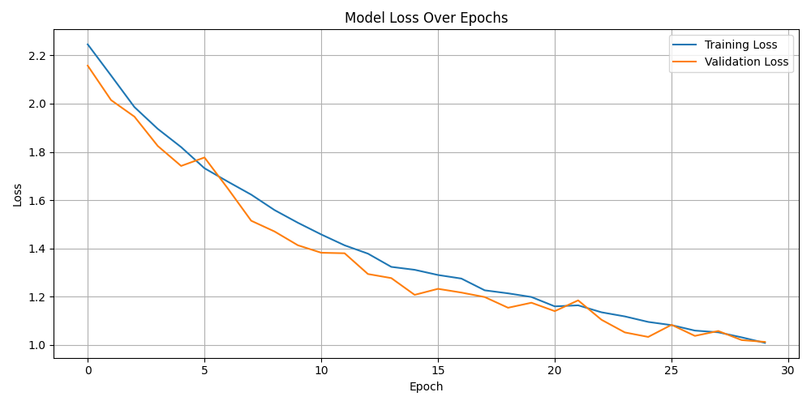

# Classification d'accessoires électroniques

*Classer automatiquement des chargeurs, smartphones, claviers et autres accessoires à partir d'images.*

## Présentation du projet

Ce projet permet de classer automatiquement des images d'accessoires électroniques en différentes catégories (smartphone, chargeur, etc.). Il s'appuie sur TensorFlow pour l'apprentissage automatique, utilise l'architecture de réseau de neurones EfficientNet pour la reconnaissance d'images, et propose une interface web conviviale grâce à Streamlit. L'objectif est de fournir un outil simple qui facilite l'identification d'accessoires électroniques à partir de photos.

## Structure du projet

La structure du projet est organisée de manière claire :

- **`dataset/`** : contient le jeu de données d'images, avec un sous-dossier par classe d'accessoire (par exemple, `Smartphone/`, `Laptop/`, etc.).
- **`train_model.py`** : script Python pour l'entraînement du modèle de classification (basé sur EfficientNet).
- **`app.py`** : application web Streamlit pour effectuer des prédictions sur de nouvelles images à l'aide du modèle entraîné.
- **`requirements.txt`** : liste des dépendances Python nécessaires pour exécuter le projet.

## Installation et utilisation

Pour utiliser ce projet en local, suivez ces étapes simples :

1. **Installer les dépendances :** Assurez-vous d'avoir Python installé, puis installez les bibliothèques requises avec la commande :  
    ```bash
    pip install -r requirements.txt
    ```  
    Cette commande installe TensorFlow, Streamlit et toutes les autres dépendances listées dans le fichier `requirements.txt`.

2. **Préparer le jeu de données :** Placez vos images d'entraînement dans le dossier `dataset/`, organisées par catégorie. Par exemple, mettez toutes les photos de smartphones dans `dataset/Smartphone/`, celles de chargeurs dans `dataset/Charger/`, et ainsi de suite pour chaque type d'accessoire. Assurez-vous d'avoir une structure avec dix sous-dossiers au total (un par classe).

3. **Entraîner le modèle :** Lancez l'entraînement du modèle en exécutant le script Python :  
    ```bash
    python train_model.py
    ```  
    Cette étape va charger les images du dataset, entraîner le réseau de neurones EfficientNet sur ces données et sauvegarder le modèle entraîné (prêt pour la prédiction).

4. **Lancer la prédiction (interface Streamlit) :** Démarrez l'application web de prédiction avec la commande :  
    ```bash
    streamlit run app.py
    ```  
    Cela ouvrira une interface web interactive dans votre navigateur. Vous pourrez alors charger une image d'accessoire électronique, et le modèle affichera la catégorie prédite (par exemple *Smartphone*, *Clavier*, etc.) pour cette image.

## 📊 Description du Dataset

Le jeu de données utilisé pour entraîner le modèle comprend des images variées d'accessoires électroniques, réparties en dix catégories. Voici quelques caractéristiques clés de ce dataset :

- **Objectif :** Fournir un ensemble de données pour faciliter la recherche en classification d'accessoires électroniques.
- **Nombre de classes :** 10 catégories d'accessoires (chargeur, manette de jeu, casque audio, clavier, ordinateur portable, écran, souris, smartphone, montre connectée et enceinte).
- **Nombre d'images :** 14 027 images au total, dont 4 027 photos originales et 10 000 images générées par augmentation.
- **Format des fichiers :** Images au format PNG.
- **Variété des prises de vue :** Les photos ont été capturées sous divers angles et conditions de luminosité pour chaque type d'accessoire.
- **Augmentations des données :** Des transformations ont été appliquées aux images (rotation, zoom, changements de luminosité/contraste, etc.) afin d'augmenter la taille du dataset et la diversité des exemples.
- **Source des images :** Images publiques collectées sur des réseaux sociaux et des sites de revente en ligne.
- **Applications possibles :** Ce dataset peut servir à entraîner des modèles de vision par ordinateur pour des projets de machine learning, d'e-commerce (reconnaissance automatique de produits sur des photos), de gestion d'inventaire ou encore des applications mobiles de reconnaissance d'objets.
- **Bénéfices de la diversité :** La combinaison d'images réelles et augmentées offre une grande diversité de données, ce qui permet d'entraîner des modèles plus précis et plus robustes face à de nouvelles images.

## Explication du fonctionnement du code

**Entraînement du modèle :** Le script `train_model.py` parcourt les images du dossier dataset, les prétraite (redimensionnement, normalisation, etc.), puis utilise le modèle EfficientNet pour apprendre à classer chaque image dans la bonne catégorie. EfficientNet est un réseau de neurones profond pré-entraîné sur un très large ensemble d'images (par exemple ImageNet). Dans ce projet, on réutilise ce modèle existant et on l'entraîne à nouveau sur nos propres images (nos dix catégories d'accessoires) afin de l'adapter à notre besoin spécifique. Au terme de l'entraînement, un fichier contenant le modèle final est enregistré sur le disque.

**Prédiction et interface :** L'application Streamlit (`app.py`) charge le modèle entraîné précédemment et offre une interface web simple pour la prédiction. L'utilisateur peut importer une photo d'accessoire électronique qu'il souhaite classer. Une fois l'image envoyée, le modèle l'analyse et prédit à quelle catégorie appartient l'accessoire. Le résultat (par exemple "Smartphone" ou "Clavier") s'affiche alors dans l'interface, ce qui permet de vérifier facilement la prédiction du modèle.

## Prérequis et dépendances

Pour exécuter ce projet, vous aurez besoin de l'environnement et des bibliothèques suivants :

- **Python :** Version 3.7 ou supérieure.
- **TensorFlow :** Version 2.x (par exemple TensorFlow 2.8) pour l'entraînement du modèle de deep learning.
- **Streamlit :** Bibliothèque pour exécuter l'application web interactive.
- **Pillow (PIL) :** Bibliothèque d'imagerie Python pour le chargement et le traitement des images (souvent installée avec TensorFlow).
- **Autres dépendances :** Par exemple NumPy (consultez le fichier `requirements.txt` pour la liste complète des packages requis).




accuracy/epochs




loss/epochs




## Auteur

Ce projet a été réalisé par **Arij Bettaieb** et **Amine Ouhiba** . correct it if needed